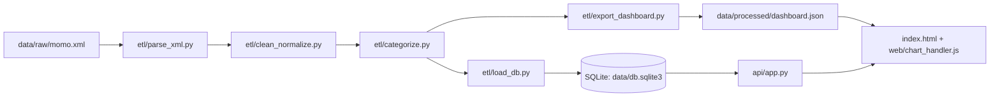

```mermaid
flowchart LR
  A[data/raw/momo.xml] --> B[etl/parse_xml.py]
  B --> C[etl/clean_normalize.py]
  C --> D[etl/categorize.py]
  D --> E[etl/load_db.py]
  E --> F[(SQLite: data/db.sqlite3)]
  D --> G[etl/export_dashboard.py]
  G --> H[data/processed/dashboard.json]
  F --> I[api/app.py]
  H --> J[index.html + web/chart_handler.js]
  I --> J
```

